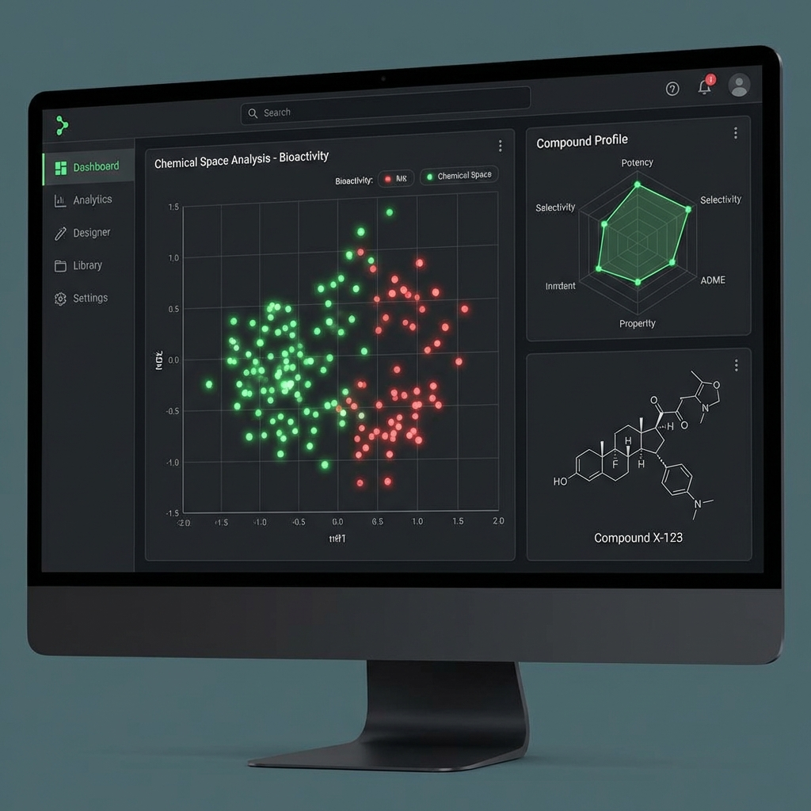

# MedChem Triage Engine 💊



A local, secure, and free **Medicinal Chemistry Decision-Support Platform**. 
This tool allows chemists to filter, analyze, and design small molecules using industry-standard ADME constraints, without sending data to the cloud.

## Features
- **Compound Triage**: Automatic filtering based on Lipinski/Veber rules and proprietary "Safety Margins".
- **Deep Analytics**: Violin plots, Risk Landscapes (Rank vs Margin), and Robustness analysis.
- **Cheminformatics**: Substructure search, Similarity search (Tanimoto), and Butina Clustering.
- **Molecular Designer**: Interactive Sketcher (Ketcher) with real-time MPO scoring.
- **Virtual Library**: Generate and screen analogs from a core scaffold instantly.
- **Reporting**: One-click PDF report generation for project summaries.

## Installation

### Option 1: Conda (Recommended)
```bash
conda env create -f environment.yml
conda activate compound-triage
```

### Option 2: Pip
```bash
pip install -r requirements.txt
```

## Usage

1. **Start the Dashboard**:
   ```bash
   streamlit run app/dashboard.py
   ```

2. **Load Data**:
   - The app comes with a `sample.sdf` for testing.
   - Enter the path to your own result CSV, or run the engine first.

3. **Run the Engine (Batch Processing)**:
   ```bash
   python run_engine.py data/raw/your_compounds.sdf data/processed/results.csv
   ```

## Folder Structure
- `app/`: Dashboard code.
- `engine/`: Core logic (Descriptors, Rules, Search, Enumeration).
- `data/`: Input/Output storage.

## 🧪 Case Study: Validating the Engine
To validate the reliability of this triage engine, we processed a diverse dataset of **50+ known compounds**, including market drugs, toxic agents, and research candidates.

**Results:**
1.  **Correct Classification**:
    *   ✅ **Safe**: Successfully identified widely used drugs like *Aspirin*, *Atorvastatin*, and *Caffeine* as "SAFE-ROBUST".
    *   ❌ **Fail**: Correctly flagged *Vancomycin* (MW > 500 violation) and *Paclitaxel* (Multiple violations).
2.  **Structural Alerts**:
    *   Detected **PAINS** (Pan-Assay Interference Compounds) in test screen, flagging a *Rhodanine* derivative.
    *   Flagged potentially reactive **Quinones**.
3.  **Discovery**:
    *   Used the **Clustering Module** to automatically group 15 distinct *Sulfonamides* from a mixed library.
    *   Using the **Virtual Library Generator**, we enumerated 20 analogs of a *Phenyl-Indole* scaffold, identifying 3 variants with improved MPO scores (>4.5) compared to the parent.

This test confirms the engine's ability to act as a "Virtual Medicinal Chemist," rapidly prioritizing high-quality lead matter.

## License
MIT
